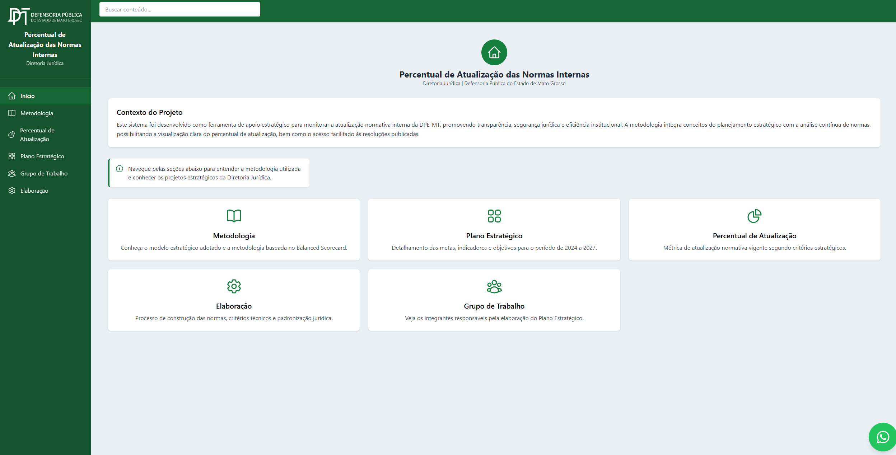
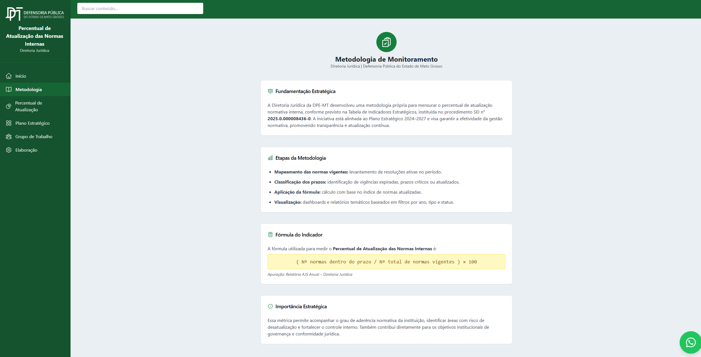
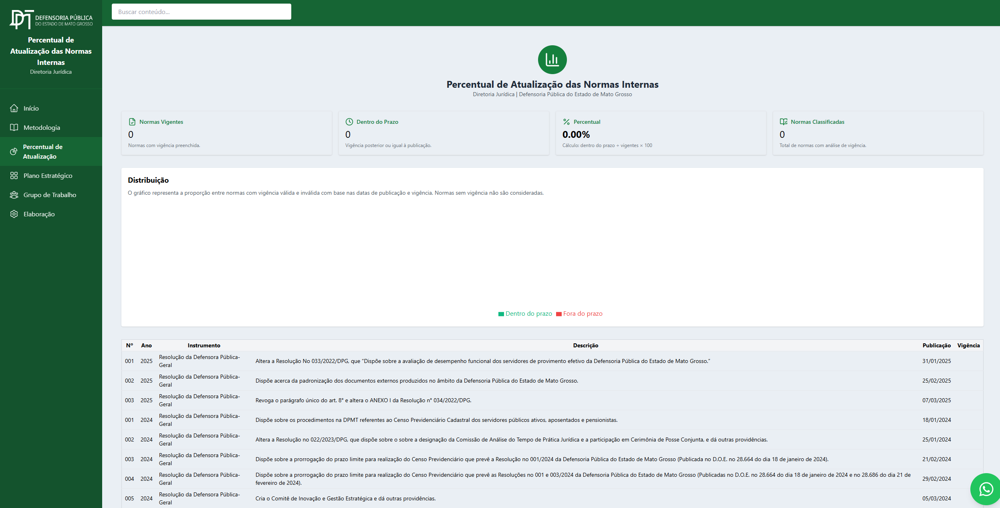
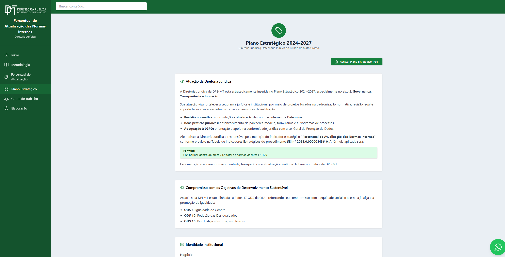
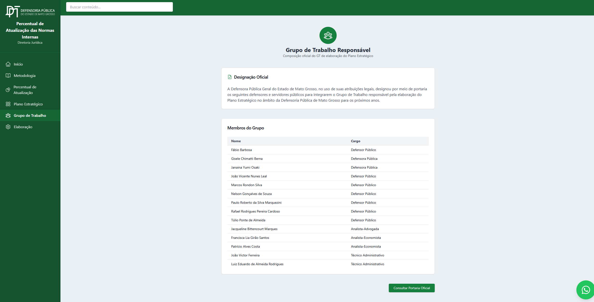
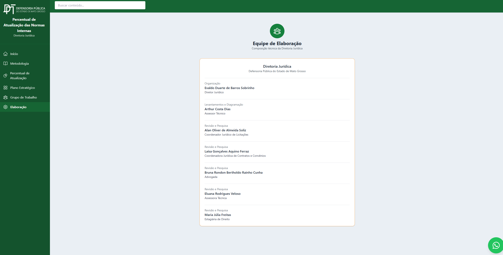

# 📊 Percentual de Atualização das Normas Internas

[](https://reactjs.org/)  
[](https://vitejs.dev/)  
[](https://tailwindcss.com/)  
[](https://developers.google.com/apps-script)  
[](https://nodejs.org/)  
[](https://github.com/google/clasp)  

---

## 📋 Descrição

Este repositório contém o código-fonte do **Portal “Percentual de Atualização das Normas Internas”** da Defensoria Pública do Estado de Mato Grosso (DPE-MT). O objetivo principal é **facilitar o monitoramento** das normas internas vigentes, permitindo:

- **Verificação do percentual de atualização** de cada norma interna (validade, prazos vencidos ou dentro do prazo).
- **Filtros dinâmicos** por ano de publicação, tipo de instrumento e status de vigência.
- **Dashboards e relatórios** que apresentam números, gráficos e tabelas atualizadas em tempo real.
- Informações institucionais sobre **metodologia**, **plano estratégico**, **grupo de trabalho** e **equipe de elaboração**.

As imagens abaixo ilustram algumas páginas do projeto:

|  |  |
|:-------------------------------------:|:---------------------------------------------------:|
| Página inicial                       | Metodologia de monitoramento                         |

|  |  |
|:-----------------------------------------------------------------:|:---------------------------------------------------:|
| Dashboard de percentuais                                         | Página do Plano Estratégico                         |

|  |  |
|:---------------------------------------------------:|:-------------------------------------------------:|
| Composição do Grupo de Trabalho                      | Equipe de Elaboração                              |

---

## 🎯 Motivação

A *Diretoria Jurídica da DPE-MT* precisava de uma forma ágil e centralizada para:

1. **Mapear todas as normas internas vigentes** e identificar, de forma contínua, aquelas cujo prazo de vigência estivesse expirado ou próximo de expirar.  
2. **Calcular e exibir o percentual de normas atualizadas** (fórmula:  
   <br>`% Atualização = (Número de normas dentro do prazo) / (Número total de normas vigentes) × 100`  
) garantindo transparência e tomada de decisão mais rápida.  
3. **Compartilhar relatórios e dashboards** que pudessem ser consultados por gestores e servidores, atendendo às diretrizes de Governança, Transparência e Inovação previstas no Plano Estratégico 2024-2027.  

O resultado é um portal web responsivo, completo e fácil de usar, que extrai dados diretamente de uma planilha Google e exibe todas as informações em tempo real.

---

## 🚀 Funcionalidades Principais

- **Página “Início”**  
  - Contextualização do projeto  
  - Botões de acesso rápido às demais seções  
  - Mensagem de boas-vindas e visão geral  

- **Página “Metodologia”**  
  - Fundamentação estratégica  
  - Etapas da metodologia (mapeamento, classificação de prazos, aplicação da fórmula e visualização)  
  - Fórmula do indicador e importância estratégica  

- **Página “Percentual de Atualização”**  
  - Métricas de normas vigentes, dentro do prazo e porcentagem calculada  
  - Gráfico de distribuição (normas dentro vs. fora do prazo)  
  - Tabela listando número sequencial, ano, instrumento normativo, descrição, data de publicação e vigência  

- **Página “Plano Estratégico”**  
  - Alinhamento ao Plano Estratégico 2024-2027 da Defensoria  
  - Compromisso com Objetivos de Desenvolvimento Sustentável (ODS 5, 10 e 16)  
  - Acesso ao PDF oficial do Plano Estratégico  

- **Página “Grupo de Trabalho”**  
  - Designação oficial do grupo (portaria)  
  - Lista de membros (nome e cargo)  
  - Botão para consultar portaria oficial  

- **Página “Elaboração”**  
  - Composição técnica da equipe de elaboração  
  - Nome, função e área de responsabilidade de cada participante  

---

## 🛠 Tecnologias Utilizadas

- **Frontend**  
  - ⚛️ **React**  
  - 🔧 **Vite** (build ultrarrápido com HMR)  
  - 🎨 **Tailwind CSS** (estilização utilitária)  
  - 📦 **TypeScript** (checagem de tipos e maior robustez)

- **Backend / Integração de Dados**  
  - 📑 **Google Apps Script** (API para acessar a Planilha Google)  
  - 🔧 **clasp** (Google Apps Script CLI para deploy e gerenciamento de versões)  

- **Outras Dependências**  
  - **Axios** (requisições HTTP, caso sejam necessárias fetchs adicionais)  
  - **date-fns** (manipulação de datas em JavaScript)  
  - **React Router** (navegação interna entre páginas)  

---

## 📂 Estrutura do Projeto

```
levantamento-normas/
├── gas/                     # Código gerado após build do Vite, pronto para deploy no Apps Script
│   ├── code.js              # Código de integração com Google Apps Script
│   ├── css.html             # CSS gerado pelo Tailwind
│   └── js.html              # JS compilado pelo Vite
│
├── public/                  # Arquivos estáticos (ícones, template PDF, etc.)
│   ├── ico-black.png
│   ├── ico-dpemt.png
│   ├── ico-white.png
│   └── pdf-template.html
│
├── src/                     # Código-fonte React + TypeScript
│   ├── components/          # Componentes reutilizáveis (Header, Layout, Spinner, etc.)
│   ├── hooks/               # Hooks customizados (por exemplo, useDarkMode)
│   ├── pages/               # Páginas principais (Inicio, Metodologia, PercentualAtualizacao, etc.)
│   ├── server/              # Integração com Google Apps Script (fetch dos dados da planilha)
│   └── types.ts             # Tipagens gerais do projeto
│
├── .env                     # Variáveis de ambiente (não versionar)
├── .eslintignore            # Regras de ESLint para ignorar arquivos/pastas
├── .gitignore               # Ignorar Node modules, arquivos de build, etc.
├── index.html               # Template HTML base para o Vite
├── package.json             # Dependências e scripts de build/deploy
├── tsconfig.json            # Configuração TypeScript
└── vite.config.ts           # Configuração do Vite (plugins, alias, etc.)
```

---

## 🧮 Organização da Planilha Google

No Google Sheets, crie uma planilha nova e adicione **exatamente** uma aba com o nome **`NORMAS`**. As colunas devem estar em **maiúsculas**, na ordem descrita abaixo:

1. `NUMERAÇÃO`         – Código sequencial (por ex. “001”, “002” etc.)  
2. `ANO`               – Ano de publicação da norma (ex.: 2023, 2024)  
3. `INSTRUMENTO NORMATIVO` – Texto curto (ex.: “Resolução DPG nº 012/2024”)  
4. `DESCRIÇÃO`         – Breve descrição do conteúdo ou objetivo da norma  
5. `DATA DE PUBLICAÇÃO` – Formato `DD/MM/YYYY` (ex.: `25/01/2024`)  
6. `LINK PARA NORMA`   – URL pública ou interna para consulta do documento oficial (pode ficar em branco se não houver)  
7. `VIGÊNCIA`          – Data de término de vigência (formato `DD/MM/YYYY`)  

Cada **linha** da aba `NORMAS` corresponde a uma norma distinta. Ao atualizar ou inserir novas linhas nessa aba, o portal refletirá automaticamente as mudanças após atualizar a página.

---

## 🔑 Variáveis de Ambiente

Crie um arquivo `.env` na raiz do projeto com a seguinte variável (não compartilhe esse arquivo publicamente, pois ele contém URLs sensíveis):

```ini
VITE_GAS_URL="https://script.google.com/macros/s/SEU_ID_DO_APPS_SCRIPT/exec"
```

- **`VITE_GAS_URL`**: URL de publicação do Google Apps Script. Esse endpoint retorna, em JSON, todos os registros lidos da planilha “NORMAS”. O frontend React usa essa URL para buscar dados em tempo real.

---

## 💻 Pré-requisitos

Antes de executar ou fazer deploy, certifique-se de ter instalado:

- [Node.js](https://nodejs.org/) (versão 14+ recomendada)  
- npm (já vem junto com o Node)  
- [clasp](https://github.com/google/clasp) instalado globalmente:
  ```bash
  npm install -g @google/clasp
  ```
- Conta Google com acesso ao Apps Script e permissão para editar a planilha

---

## ⚙️ Instalação e Execução Local

1. **Instale as dependências**  
   ```bash
   npm install
   ```

2. **Configurar a autenticação do Google Apps Script**  
   ```bash
   clasp login
   ```
   Siga as instruções para autorizar o acesso à sua conta Google.

3. **Executar em modo de desenvolvimento**  
   ```bash
   npm run dev
   ```
   - Abre o Vite em `http://localhost:5173` (ou porta disponível)  
   - O HMR (Hot Module Replacement) permitirá atualizações instantâneas ao editar componentes  

4. **Testar conexão com Apps Script**  
   - Garanta que a variável `VITE_GAS_URL` aponte para um Apps Script publicado com permissão “Qualquer pessoa, mesmo anônimos” ou permissão adequada de leitura.  
   - Ao abrir `http://localhost:5173`, a tela de “Percentual de Atualização” deverá exibir dados (ou tabela vazia, se não houver normas cadastradas).

---

## 📦 Como Fazer Deploy

O deploy acontece em duas etapas principais:

1. **Build do Frontend (Vite → pasta `gas/`)**  
   ```bash
   npm run build
   ```
   - Isso gera a pasta `gas/` contendo:  
     - `css.html` (CSS injetado)  
     - `js.html` (bundle JavaScript)  
     - `index.html` (HTML base adaptado para Apps Script)

2. **Envio ao Google Apps Script via clasp**  
   ```bash
   npm run deploy
   ```
   Esse comando executa internamente:
   ```bash
   npm run build
   clasp push
   clasp deploy --description "Nova versão do portal: Percentual de Atualização"
   ```
   Ao final, o Apps Script retorna uma **URL de execução** (semelhante a `https://script.google.com/macros/s/SEU_ID/exec`). Essa é a mesma URL que deve ficar na variável `VITE_GAS_URL`.  
   - **Importante**: Defina, nas configurações do Apps Script, a permissão de execução como “Qualquer pessoa, mesmo anônimos” (ou conforme política interna da instituição).

Após o deploy, o portal estará disponível publicamente no endereço do Apps Script.

---

## 🗂 Estrutura de Branches e Versionamento

- **`main`** – Branch principal, sempre refletindo a versão em produção (deploy feita).  
- **`develop`** (opcional) – Para manter funcionalidades em desenvolvimento antes do merge para `main`.  
- **`feature/*`** – Para cada nova funcionalidade ou correção, crie uma branch do tipo `feature/nome-da-feature`.  

Caso prefira um fluxo GitFlow mais formal:

```bash
git checkout -b develop          # Cria ou atualiza branch de desenvolvimento
git checkout -b feature/nova-pagina  # Exemplo de branch para recurso específico
```

---

## 🎨 Layout e Design

- Paleta de cores baseada na **identidade visual da Defensoria Pública de Mato Grosso**: tons de verde escuro e claro, branco e cinza-claro.  
- Componentes:  
  - **Header**: barra superior com logo da DPE-MT, campo de busca fictício (não funcional por enquanto) e ícone de usuário/WhatsApp.  
  - **Sidebar (Menu Lateral)**: navegação vertical fixa com ícones (Home, Metodologia, Percentual de Atualização, Plano Estratégico, Grupo de Trabalho, Elaboração).  
  - **Cards e Tabelas**: utilizando classes utilitárias do Tailwind para espaçamento, bordas arredondadas e sombras suaves.  
  - **Botões**: verde escuro para ações principais (ex.: “Acessar Plano Estratégico”) e hover em tom levemente mais claro.

---

## 🔧 Como Contribuir

1. **Fork** deste repositório.  
2. Crie uma branch para sua feature:  
   ```bash
   git checkout -b feature/nome-da-sua-feature
   ```
3. Faça commits das alterações:  
   ```bash
   git commit -m "Descrição curta da alteração"
   ```
4. Envie para o seu fork:  
   ```bash
   git push origin feature/nome-da-sua-feature
   ```
5. Abra um **Pull Request** descrevendo a feature, correção de bug ou melhoria.  

---

## 📞 Contato e Mais Informações

- **Diretoria Jurídica – DPE-MT**  
- **Repositório no GitHub**:  
  - https://github.com/zeraiden56/levantamento-normas  
- **Planilha de Dados**:  
  - Link interno no Google Sheets (restrito ao grupo de trabalho)  

---

## 📜 Licença

Este projeto está licenciado sob a [MIT License](./LICENSE). Sinta-se à vontade para clonar, adaptar e contribuir, desde que mantenha os devidos créditos à Defensoria Pública do Estado de Mato Grosso.

---
